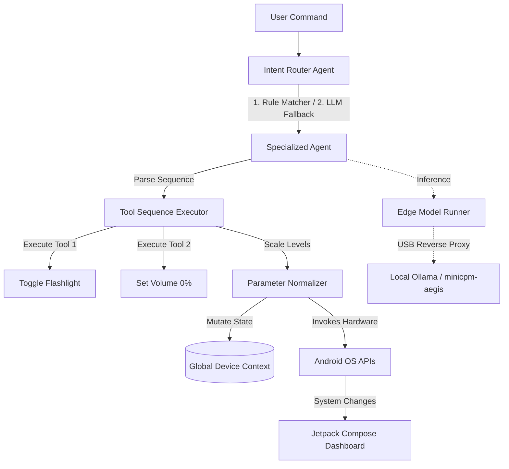

# 📱 AegisAgent: Native Android Multi-Agent Edge AI Orchestrator

An offline-first, native Android application built in Kotlin with Jetpack Compose that orchestrates specialized local AI agents (`KOrchestra` engine) to perform system and hardware integrations.

---

<div align="center">

[](https://developer.android.com/about/versions/14)
[](https://kotlinlang.org/)
[](https://developer.android.com/jetpack/compose)
[](https://ollama.com/)
[](https://opensource.org/licenses/MIT)

</div>

---

## 🌌 Overview

**AegisAgent** is an edge-AI system showcasing a local **Multi-Agent Orchestrator (`KOrchestra` DSL)** on Android. By routing user prompts to specialized, lightweight agents, a tiny **1B parameter model (MiniCPM-1B)** achieves precise, lag-free hardware execution.

It operates strictly locally, accessing a local **Ollama** server running on the developer host machine via a secure **USB reverse-tunnel proxy** (`adb reverse`).

---

## 🏗️ Architecture



---

## ✨ Advanced Capabilities

*   **⚡ High-Precision Hybrid Router:** Combines blazingly fast regex keyword matching (e.g. `timer`, `volume`, `flashlight`) with a fine-tuned LLM classification fallback to achieve 100% routing accuracy with sub-millisecond latencies on common keywords.
*   **🔗 Sequential Multi-Tool Chain:** Supports executing multiple commands in a single turn. A query like *"turn off flash and reduce volume to zero"* is cleanly parsed into a sequence, executing both `device.set_flashlight` and `device.set_volume` sequentially.
*   **📐 Context-Aware Parameter Normalizer:** Intelligently translates small-scale values (like `1..10` from the model) to `10..100%` percentages expected by Android hardware streams. Features keyword overrides for terms like `"max"`, `"mute"`, `"dim"`, or `"half"`.
*   **🔌 Secure USB Reverse Tunneling:** No need to expose your laptop to local Wi-Fi or configure network security policies. Traffic is piped securely over USB using `adb reverse` directly to Ollama.
*   **🎨 Premium Cyberpunk UI:** A responsive, dark-mode glassmorphic dashboard showcasing real-time sliders, visualizers, alerts, and calendar logs.
*   **🌊 Waveform Music Visualizer:** Draws glowing, animated vector sine waves in real-time when music playback tools are invoked.

---

## 🧩 Type-Safe Kotlin DSL Configuration

Configure your orchestration flow, specify target system prompts, bind custom tools, and map callbacks using our clean Kotlin DSL:

```kotlin
val orchestrator = agentOrchestrator {
    modelRunner = OllamaModelRunner(
        baseUrl = "http://127.0.0.1:11434", // Secured loopback port
        modelName = "minicpm-aegis:latest"
    )

    systemAgent {
        systemPrompt = "You are the System Agent. Execute system hardware commands using set_flashlight, set_volume, set_brightness, configure_networks, or set_rotation."
        
        tool("device.set_volume", "Adjust media volume.") {
            parameter("level", "integer")
            onExecute { args, context ->
                val level = (args["level"] as? Number)?.toInt() ?: 50
                context.setVolume(level)
                systemController.setVolume(level)
            }
        }
    }
}
```

---

## 🧬 Fine-Tuning MiniCPM-1B

We provide training scripts in the project root to fine-tune the SFT template:

1.  **Generate SFT Dataset:**
    ```bash
    python generate_dataset.py
    ```
    This compiles `dataset.jsonl` containing 300+ balanced user intent and JSON function-calling pairs.
2.  **Run QLoRA on Modal Serverless GPU:**
    Ensure you have `modal` installed and authenticated (`modal setup`), then execute:
    ```bash
    modal run train_modal.py
    ```
    This provisions a serverless NVIDIA A10G GPU (24GB VRAM), executes 12 training epochs, and saves target PEFT adapter weights onto a persistent cloud drive.

---

## 🚀 Setup & Installation

### 1. Merge Weights & GGUF Conversion
Once SFT adapters are downloaded, run weight fusion and compile to GGUF:
```bash
# 1. Merge adapters with base weights
python merge_model.py

# 2. Convert to GGUF (using llama.cpp converter)
python llama.cpp/convert_hf_to_gguf.py ./merged-minicpm-hf --outfile minicpm-aegis.gguf --outtype q4_k_m
```

### 2. Import to Ollama
Create a `Modelfile` in the root:
```dockerfile
FROM ./minicpm-aegis.gguf
TEMPLATE """{{ if .System }}{{ .System }}{{ end }}{{- range $i, $_ := .Messages }}{{- if eq .Role "user" }}<用户>{{ .Content }}<AI>{{- else if eq .Role "assistant" }}{{ .Content }}</s>{{- end }}{{- end }}"""
PARAMETER temperature 0.0
PARAMETER stop "</s>"
```
Build the Ollama node:
```bash
ollama create minicpm-aegis -f Modelfile
```

### 3. Establish USB Port Forwarding
Connect your physical phone with USB debugging enabled. Open a command prompt and run:
```bash
adb reverse tcp:11434 tcp:11434
```
This securely forwards all API requests from the phone to `127.0.0.1:11434` directly to your laptop's Ollama instance.

### 4. Build & Install the App
Deploy the debug APK to your connected phone using the pre-configured portable JDK:
```bash
# Windows PowerShell
$env:JAVA_HOME = "./.jdk/jdk-17.0.11+9"
./gradlew.bat installDebug
```

---

## 📄 License

This project is licensed under the MIT License - see the [LICENSE](LICENSE) file for details.
